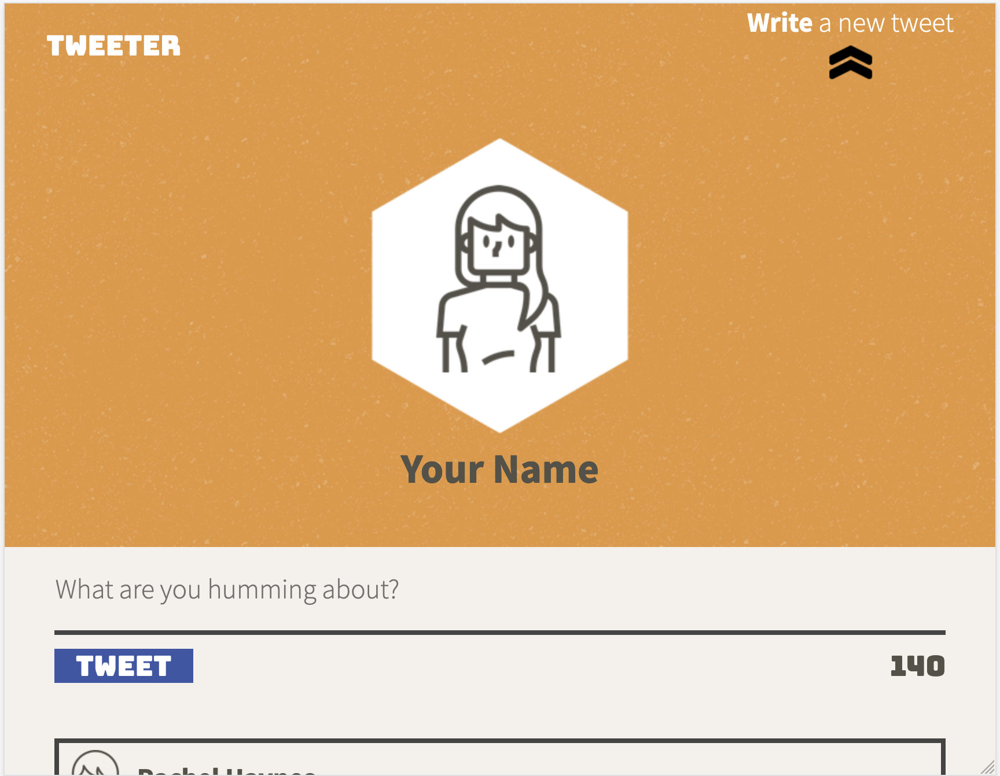
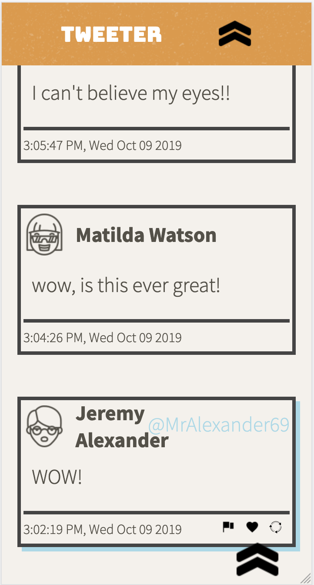

# Tweeter Project

Tweeter is a single-page AJAX-based Twitter clone using jQuery, HTML5, and CSS3. Building upon HTML, CSS, JS, jQuery and AJAX front-end skills. With a focus on responsive design using CSS

## Final Product

A look at the mobile view:

## Getting Started

1. Fork this repository, then clone your fork of this repository.
2. Install dependencies using the `npm install` command.
3. Start the web server using the `npm run local` command. The app will be served at <http://localhost:8080/>.
4. Go to <http://localhost:8080/> in your browser.

## Dependencies

- body-parser
- chance
- Express
- Node 5.10.x or above

### Dev Dependencies

- Nodemon
- eslint

### Future Considerations

- improve the way the date is displayed at the bottom of each tweet
- add `{ curser: pointer }` to the *like*, *rt*, and *flag* icons on `:hover`
- make font sizes adjust to accomodate small screens.
- this could be a good opportunity to practice using SASS